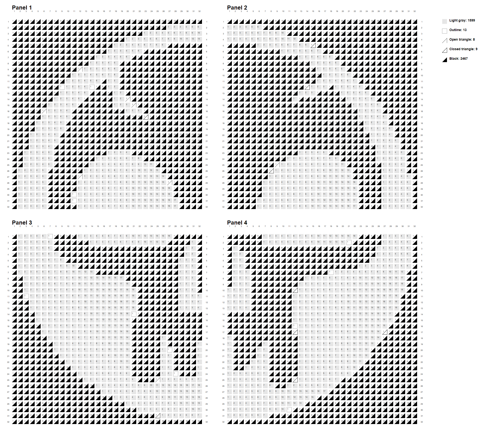
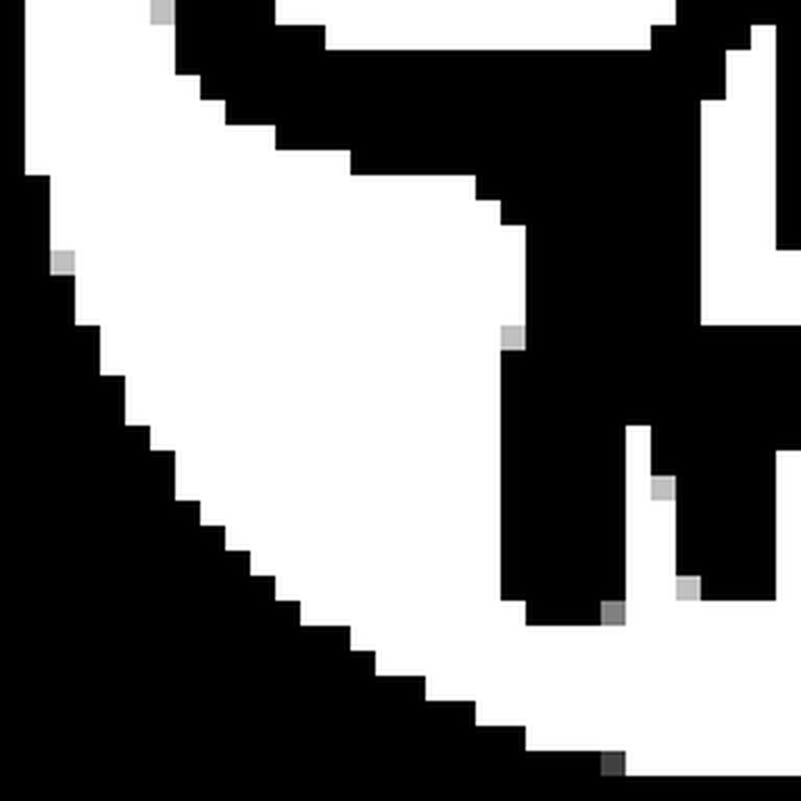

# Edit Mozabrick

If you're here that means that you got yourself a Mozabrick kit. I got one as a present and felt bad about the image conversion offerred by Mozabrick themselves: the edges are a bit jagged, no dithering, no way to edit the output to add some details. So, I made this small tool that lets you manipulate grayscale images and get proper Mozabrick instructions.
Processes your images into panels of precise pixel grids with 5 different shading levels and generate both visual and text-based instructions for assembly.

<table>
  <tr>
    <td><b>Grayscale Image</b></td>
    <td><b>Instructions</b></td>
    <td><b>Individual Panel</b></td>
  </tr>
  <tr>
    <td></td>
    <td></td>
    <td></td>
  </tr>
  <tr>
    <td><i>Can be a screenshot from Mozabrick PDF</i></td>
    <td><i>After editing the image, get updated instructions</i></td>
    <td><i>Split the image in as many panels as you need</i></td>
  </tr>
</table>

## Features

- Convert any image to a pixelated mosaic with 5 shading levels — same as in the standard Mozabrick kit
- Split large images into multiple buildable panels (default 32x32 pixels per panel)
- Generate Mozabrick-formatted assembly instructions for each panel
- Apply dithering effects for smoother transitions between shades \[underwhelming atm, easier to dither images manually in an image editor\]
- Rescale panels for larger sets

## Installation

```bash
# Clone the repository
git clone https://github.com/yourusername/mozabrick.git
cd mozabrick

# Install dependencies
pip install -r requirements.txt
```

## Requirements

- Python 3.11+
- PIL/Pillow
- NumPy
- PyCairo

## Basic Usage

You can start by copy-pasting the image from the Mozabrick PDF. Then, convert it to grayscale of the needed dimensions. After that you can edit the image in any editor you prefer to add diheting, clean up moshed details, add pixel-art ormnaments — whatever you like. Finally, generate the instructions and get to assembling the kit with your improvements!

```python
from mozabrick import MozabrickProcessor, MozabrickInstructionExporter

# Initialize processor with default 32x32 panel size in a 2x2 layout
processor = MozabrickProcessor(panel_size=32, layout=(2, 2))

# Convert an image to a matrix
matrix = processor.image_to_matrix("your_image.jpg")

# Export 5-tone grayscale image
processor.matrix_to_image(matrix, "mosaic_output.png")

# Generate panel images at a specific size
processor.save_panels(matrix, "panel", target_panel_size=1024)

# Create building instructions
exporter = MozabrickInstructionExporter(processor)
exporter.export_text(matrix, "instructions.txt")
exporter.export_image(matrix, "instructions.png")
```

Alternatively, use the [CLI](mozabrick/cli.py) and read the corresponding [README](mozabrick/README.md)

## Understanding the Output

MozaBrick generates several types of outputs:

1. **Full Mosaic Image**: A pixelated version of your original image
2. **Individual Panels**: Separate images for each panel in the mosaic
3. **Text Instructions**: A text file with numerical values (1-5) for each pixel
4. **Visual Instructions**: An image with symbols and sequence numbers for building

The 5 shading levels correspond to:
1. White - Light gray filled square
2. Light Gray - Empty square with outline
3. Medium Gray - Open right triangle
4. Dark Gray - Closed triangle outline
5. Black - Black filled triangle

*No support for the 6th tone (yellow base board)*

## Advanced Usage

### Customizing Panel Size and Layout

Create a 3x3 layout with 16x16 pixel panels

```python
processor = MozabrickProcessor(panel_size=16, layout=(3, 3))
```

### Apply Dithering for Smoother Transitions

Apply dithering to the whole image or specific areas with a mask. Blacked out pixels on the mask image indicated where dithering is allowed.

```python
dithered_matrix = processor.apply_dithering(matrix)

# Apply dithering only to specific areas using a mask
dithered_matrix = processor.apply_dithering(matrix, mask_path="dither_mask.png")
```

### Editing Individual Pixels

```python
# Edit a specific pixel at position (x, y) to value 3
matrix = processor.edit_pixel(matrix, x=10, y=15, new_value=3)
```

## Workflow Recap

1. Start with a high-contrast image for best results
2. Process the image with MozaBrick
3. Adjust individual pixels if needed
4. Apply dithering for smoother gradients
5. Generate instructions
6. Build your physical mosaic!

## License

[MIT License](LICENSE)

## Contributing

Contributions are welcome! Please feel free to submit a Pull Request.